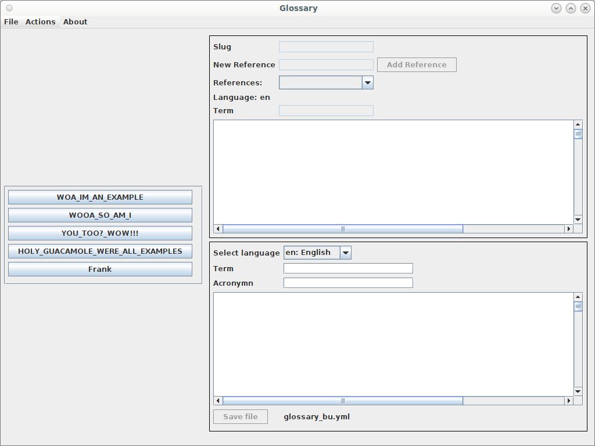
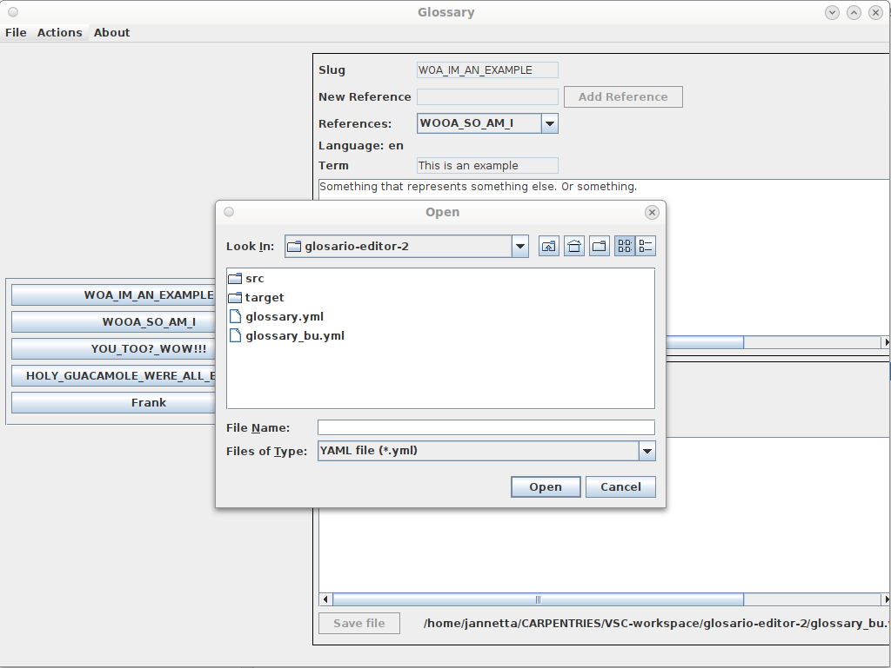
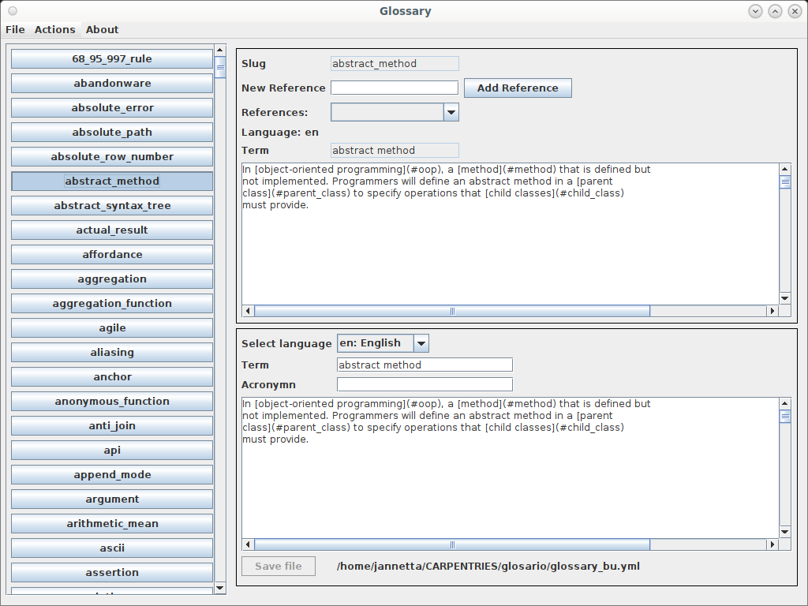
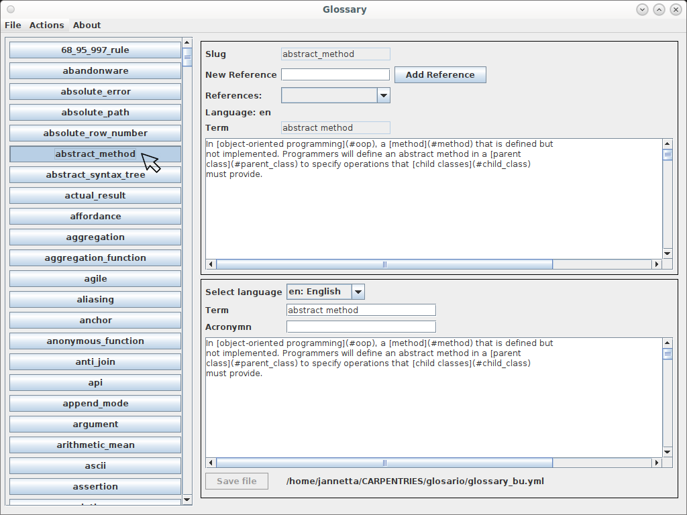

# Glosario-Editor-2 #

Glosario-Editor-2 is an editor for updating the Carpentries glossary which is maintained in the Glosario project.

## Why an editor?

I kept making indentation errors and introducing errors in parts of the document that I didn't even work on. So I decided to write an editor that will:
 - prevent me from inserting unintentional characters in parts of the document
 - help to make sure that the entries I make are properly formatted
 - make it easier to find the entry I want to work on

 ## Why the 2?

 I asked my son to write and editor because I was too busy with work. However, he didn't quite write it the way I wanted it so I rewrote the editor merging his code and ideas with mine.

## Requirements
 
 GlosarioEditor2 is written in Java and should run on any OS that has the Java Runtime Engine installed. It needs the Java Runtime Environment version 11 or later to be installed on your computer. The JRE needs to be in your path.

You can test whether the JRE is available on your computer by opening a terminal (in Linux) or the Command Shell (in Windows) and type:

```java -version```

If you get some kind of error then either the JRE is not installed or it is not in the path. If you get a message similar to this:

```
java version "1.8.0_271"
Java(TM) SE Runtime Environment (build 1.8.0_271-b09)
Java HotSpot(TM) 64-Bit Server VM (build 25.271-b09, mixed mode)
```
then the JRE is installed. In the case of the example JRE version 1.8.0_271 is installed and this would not suffice. You will need at least version 11:

```
java version "11.0.9" 2020-10-20 LTS
Java(TM) SE Runtime Environment 18.9 (build 11.0.9+7-LTS)
Java HotSpot(TM) 64-Bit Server VM 18.9 (build 11.0.9+7-LTS, mixed mode)
```

 ## Installation

All you need to do is to download the zip from the Releases section in GitHub. The Releases section usually on the right hand side of the homepage of the repository page.

You need to unzip the file on your hard drive into a directory of its own.

There is a run.sh script to run the program on Linux and a run.bat for running it in Windows.

## Running GlosarioEditor2

When the program starts up it should look like this:



The editor requires a couple of files to start up and when they do not exist it will automatically create them when you run the program. The two files, glossary.yml and system.properties will be created in the directory you are running the program from. So, for example, if you created a directory called ```GlosarioEditor2``` in your home directory, and extracted the zip into this directory, you should now see the following five files in the directory:

 - glossary.yml
 - GlosarioEditor2.jar
 - run.sh
 - run.bat
 - system.properties

You can now use the File menu (at the top left of the window) to open the actual glossary file which you should have somewhere on your hard-drive where you cloned the glosario repository:


 
Navigate to your repository directory and open glossary.yml. The location where you load this version of the file from will be saved in the system.properties file so that, the next time you run the editor, it will default to that location and open that version of the file.

When the file is loaded the buttons to the left will show all the slugs in the file:



At the bottom of the GlosarioEditor2 window, you should see a ```Save``` button and next to this button will be the name of the file that your changes will be saved to. 

You can now edit the glossary in the following ways:

1. To Select a slug for making changes, find the slug button on the left and click it.



2. The English entry for the slug is loaded into the form on the right. The text area in the top section is not editable. This is used as a reference to do the translation in the bottom section. However, in the top section, it is possible to add a new reference by adding the reference text in the text field that is labeled with ```New Reference``` and then clicking the ```Add Reference``` button. It is not yet possible to edit or delete an existing reference.

1. To edit the language entry for a slug, select the language in the bottom section and make the necessary changes.
1. The moment any changes are made, the ```Save file``` button will become enabled and when it is pressed the file will be saved. 
1. To add a new slug, click on ```Actions``` and then ```New Slug``` in the menu at the very top. This will clear the ```Slug``` text field and make it editable. It will also display and enable the ```Add Slug``` button. Press the ```Add Slug``` button to add the new slug.

## Still to do

1. New slugs should be inserted in alphabetical order. At the moment they are just appended to the end of the file.
1. Functionality to delete a slug.
1. Functionality to delete a reference.
